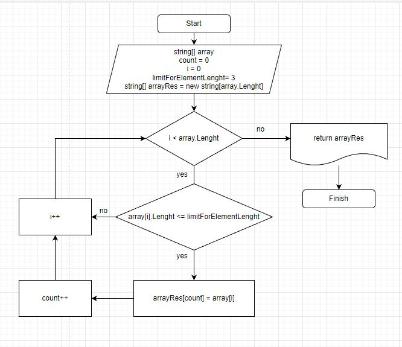

# GeekBrainsC-ControlWork

# Итоговая проверочная работа.

## Задача:
Написать программу, которая из имеющегося массива строк формирует массив из строк, длина которых меньше либо равна 3 символа. Первоначальный массив можно ввести с клавиатуры, либо задать на старте выполнения алгоритма. При решении не рекомендуется пользоваться коллекциями, лучше обойтись исключительно массивами.

## Описание решения:
1. Создаём метод **ArrayToLess3SymbolsPerElement** с принимаемыми параметрами в виде массива из строк и аргумента указывающего максимально допустимую длину элемента в возвращаемом массиве(**limitForElementLenght**).
2. Внутри метода создаём результирующий массив длиной равный принимаемому.
3. Задаём цикл For с условием пока счетчик меньше длины массива.
4. Создаём ветвление: Если длина элемента массива <= **limitForElementLenght**
+ В случае ветки **No** изменяем счетчик на +1 и приступаем к новой итерации цикла.
+ В случае **Yes** сохраняем данный элемент в результирующий массив и также изменяем счетчик +1.
5. Когда все элементы массива были проверены и соответствующие условиям(limitForElementLenght = 3 в данном случае) элементы помещены в результирующий массив, возвращаем его(**arrayRes**).
## Блок-схема:
